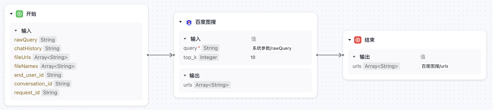
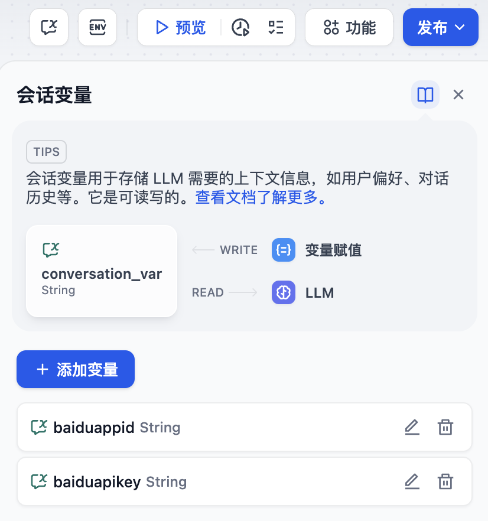

## baidu_picsearch

**Author:** BenedictKing
**Version:** 0.0.1
**Type:** tool

### Description

  
*图1: Dify中插件调用流程图*

  
*图2: 搜索结果示例*

### 使用说明

0. **创建千帆应用**  
   访问[千帆平台控制台](https://console.bce.baidu.com/ai_apaas/personalSpace/app)：
   - 点击「新建应用」 
   - 应用类型选择「工作流Agent」
   - 参考流程图：
   - 完成配置后点击「发布」按钮
   - 在「API/SDK」标签页获取应用ID：  
     

1. **一键导入示例应用**  
   创建新应用，选择DSL导入功能：
   ```bash
   dify-example.yml  # 示例应用配置文件
   ```

2. **配置会话变量**  
   将在千帆平台获取的ID填入会话变量：
   - `baiduappid`: 此处填写API/SDK页面的应用ID
   - `baiduapikey`: 百度图像搜索API密钥
   

3. **配置插件**
   配置百度图搜插件参数，参考示意图：

   > 如何获取：请登录百度AI开放平台，创建应用后获取API Key和App ID

### 异常处理

**问题描述：** 安装插件时遇到异常信息：plugin verification has been enabled, and the plugin you want to install has a bad signature，应该如何处理？

**解决办法：** 在 .env 配置文件的末尾添加 `FORCE_VERIFYING_SIGNATURE=false` 字段即可解决该问题。添加该字段后，Dify 平台将允许安装所有未在 Dify Marketplace 上架（审核）的插件，可能存在安全隐患。


